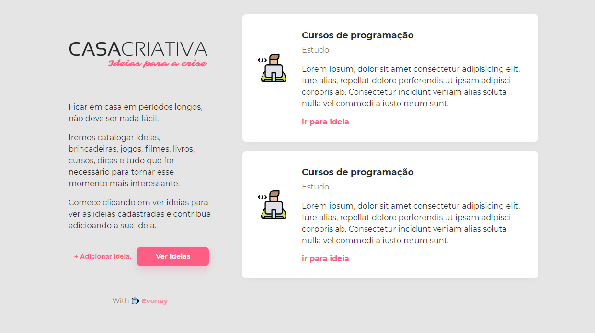
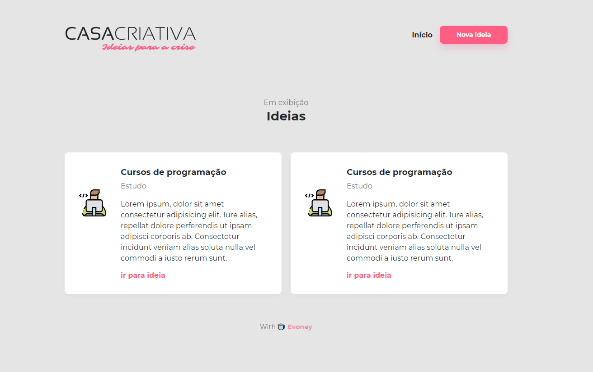
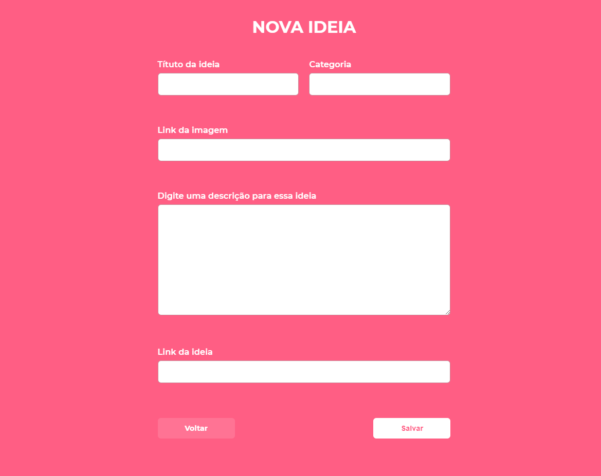

<h1 align="center">
  
    <br>
</h1>

<h4 align="center">
  A application to add some ideas that you thought into the lockdown of the pandemic 
</h4>

<p align="center">


 
</p> 

<p align="center">
  <a href="#rocket-built-with">Built with</a>&nbsp;&nbsp;&nbsp;|&nbsp;&nbsp;&nbsp;
  <a href="#information_source-how-to-run">How to run</a>&nbsp;&nbsp;&nbsp;|&nbsp;&nbsp;&nbsp;
  <a href="#page_facing_up-license">Licence</a>&nbsp;&nbsp;&nbsp;|&nbsp;&nbsp;&nbsp;
  <a href="#mailbox_with_mail-get-in-touch">Get in touch</a>
</p>
<br><br>

## :rocket: Built with

This project was developed with the following technologies:

-  [Node.js](https://nodejs.org/)
-  [Express](https://expressjs.com/)
-  [sqlite3](https://sqlitebrowser.org/)
-  [nunjucks](https://www.npmjs.com/package/nunjucks)
-  [VS Code](https://code.visualstudio.com/)

## :information_source: How to run

### Requirements
To run the app, you will need [Git](https://git-scm.com), [Node.js](https://nodejs.org/) v12.13.1 or higher, [Npm](https://www.npmjs.com/), [SQLite3](https://sqlitebrowser.org/).
<br>

### Application
Now clone the repository and install the dependencies.
```bash
# to clone the repository
git clone https://github.com/Evoney/CasaCriativa.git

# go into the folder
cd CasaCriativa/

#install the backend dependencies
npm install

```

# run application
```bash
npm run dev
```




## :page_facing_up: License

This project is under the MIT license. 

## :mailbox_with_mail: Get in touch!

[LinkedIn](www.linkedin.com/in/evoney-mendonça)

---

Made with :coffee: and ♥ by Evoney.
